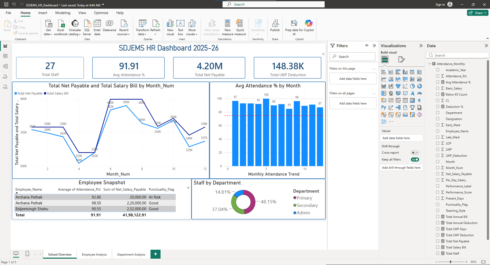
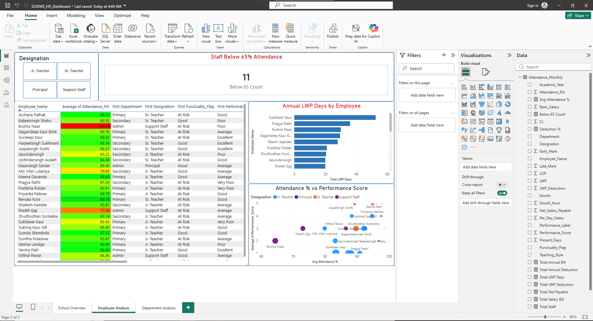
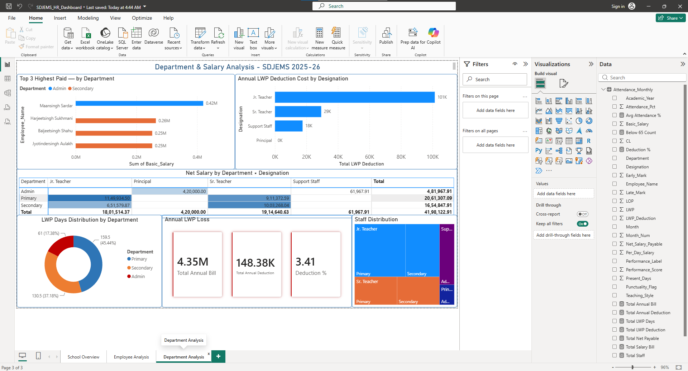

# SDJEMS HR Analytics — 2025-26
### End-to-end HR Analytics System for Shri Dashmesh Jyot English Medium School, Nanded

---

## Problem Statement
The school had 12 months of employee attendance data scattered across 
separate Excel files with no centralised reporting. This project builds 
a complete analytics pipeline to track staff performance, salary costs, 
and attendance patterns across 27 employees for the academic year 2025-26.

## Dataset
- **Source:** Real school HR data (employee names anonymised)
- **Records:** 270 rows × 23 columns
- **Coverage:** 12 months (May 2025 – April 2026)
- **Employees:** 27 staff members across Primary, Secondary & Admin departments

## Business Questions Answered
1. Which employees have attendance below 65% in any month?
2. Who has the highest Late Mark + Early Mark combined?
3. Which month had the worst overall school attendance?
4. What is the monthly salary bill trend across the year?
5. Top 5 costliest absentees by LWP deduction?
6. Net vs Basic salary gap — which designation loses most?
7. Who exhausted CL and shifted to LWP?
8. Which employees had perfect attendance (zero LWP all year)?
9. Which employees show deteriorating attendance month over month?
10. Cost-cut analysis — which designation tier to review?
11. Top 3 highest-paid employees per department?

## Tools & Stack
| Layer | Tool |
|---|---|
| Data Cleaning | Python (Pandas), Jupyter Notebook |
| Database | MS SQL Server (T-SQL, SSMS) |
| Dashboard | Power BI (DAX) |
| Data Format | Excel, CSV |

## Project Structure
sdjems-hr-analytics/

├── data/                  # Cleaned master dataset

├── notebooks/             # Jupyter notebook with EDA + insights

├── sql/                   # SQL Server setup + 11 analysis queries

├── pipeline/              # Python cleaning script

└── dashboard/             # Power BI dashboard screenshots

## Key Findings
- **Jr. Teachers** account for ₹1,01,000 in annual LWP deductions — highest of any designation
- **Primary department** has the largest headcount (45%) but lowest avg salary
- **3.41%** of total salary bill was lost to unpaid leave across the year
- **8 employees** maintained zero LWP for the full academic year

## Dashboard Preview
### Page 1 — School Overview

### Page 2 — Employee Analysis

### Page 3 — Department Analysis

---
*Built by Devraj Singh Sukhai | Junior Data Analyst | SDJEMS, Nanded*
*Stack: Python · MS SQL Server · Power BI · Excel*
